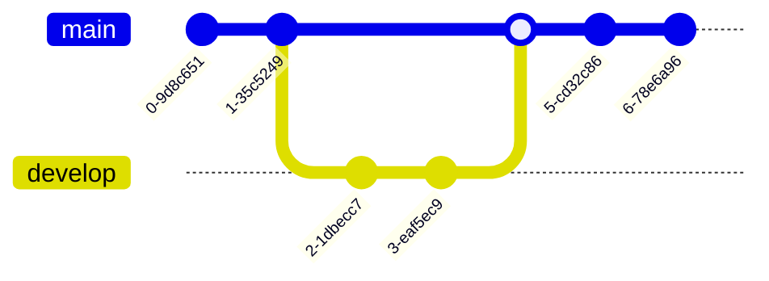

## Mermaid

Diagrams with mermaid, make sure it is enabled in the `_config.yml`.
Here is a simple example:

```html
<!-- To generate a diagram -->
<div class="mermaid">
sequenceDiagram
    Alice->>John: Hello John, how are you?
    John-->>Alice: Great!
</div>
```

> 💡 Now render also work with the GitHub markdown highlight.



That will be rendered into this:



You can also go with more complex features and diagrams from the [documentation](https://mermaid-js.github.io/mermaid/),
and try it out with the [live editor](https://mermaid.live/).

### SequenceDiagram

<div class="mermaid">
sequenceDiagram
    participant Alice
    participant Bob
    Alice->>John: Hello John, how are you?
    loop Healthcheck
        John->>John: Fight against hypochondria
    end
    Note right of John: Rational thoughts prevail!
    John-->>Alice: Great!
    John->>Bob: How about you?
    Bob-->>John: Jolly good!
</div>

### Flow


### Class


### State


### ER


### Gantt


### User Journey


### Git



### Pie


### Mindmap


### QuadrantChart


### XYChart


