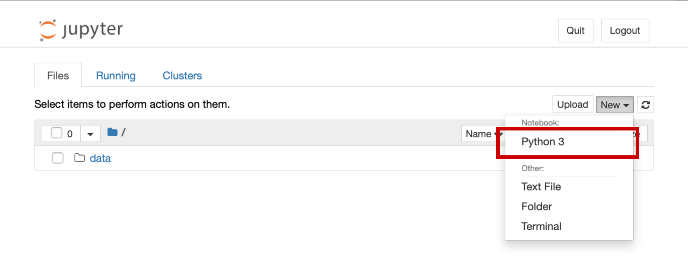

## Installing Python through Anaconda
[Python](https://python.org/) is a popular language for scientific computing, and great for general-purpose programming as well. Installing all of its scientific packages individually can be a bit difficult, however, so we recommend the all-in-one installer Anaconda.

1. Navigate to the [installation page](https://docs.anaconda.com/free/anaconda/install/) for Anaconda.
2. Download the appropriate installer for your operating system.
3. Double click the installer icon and follow the set-up instructions, keeping most of the default options. If you are Windows, make sure to choose to choose the option **Make Anaconda the default Python** during installation.

## Installing a Text Editor

You will need a text editor for this workshop. If you do not have a preferred text editor, we recommend [Visual Studio Code (VS Code)](https://code.visualstudio.com/download). Download VSCode at the link and install on your computer.

## Start a Jupyter notebook
From Finder or Spotlight (Mac OS) or the Start Menu (Windows) find the Anaconda Navigator.  The icon looks like a green circle.  Click Launch under Jupyter Notebook.  It may take a few seconds to load the page, especially if it is the first time you have ever used the jupyter notebook, so don't panic if nothing loads for a few seconds.  Then a new window should open in your default internet browser. Use the file navigation window to navigate to `Desktop` and then to the `cms-workshop` folder.  In the upper right hand corner, click New, then choose Python 3 from the dropdown list (shown below)

This will start a new Jupyter notebook using Python 3. You're ready to go!

#### Acknowledgements
This introduction is modelled after a MolSSI educational course: Ringer McDonald, A., & Nash, J. (2019). Python Data and Scripting Workshop for Computational Molecular Scientists (Version 2020.06.01). 
The Molecular Sciences Software Institute. https://doi.org/10.34974/MXV2-EA38
