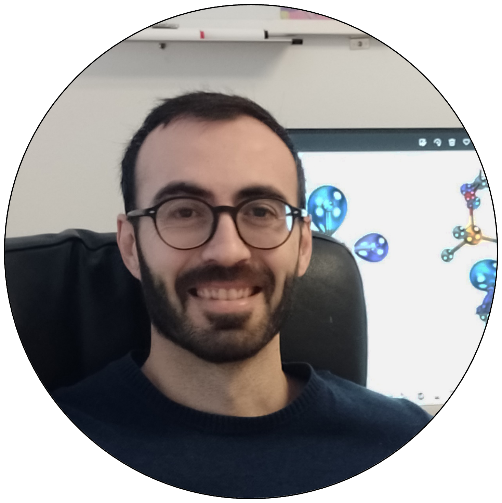

--- 
layout: page
title : Organizers
feature-img: "assets/img/header/tab_back.png"
position: 6
---

### Meet the CAMLC24 team

<html>
<head>

</head>
<body>

<table id="customers">
  <tr>
    <td>
      <a href="https://thealegregroup.com/">
        
         
Dr. Juan Alegre

      </a>
    </td>
    <td>
      <a href="https://patonlab.com/">
        
         
Dr. Robert Paton

      </a>
    </td>
    <td>
      <a href="https://www.nist.gov/people/heidi-klem">
        
         
Dr. Heidi Klem

      </a>
    </td>
    <td>
      <a href="https://rlaplaza.github.io/">
        
         
Dr. Ruben Laplaza

      </a>
    </td>
  </tr>
  <tr>
    <td>
      <a href="https://github.com/ddgunizar">
        
         
David Dalmau

      </a>
    </td>
    <td>
      <a href="https://github.com/iribirii">
        
         
Iñigo Iribarren

      </a>
    </td>
    <td>
      <a href="https://thijsstuyver.com/">
        
         
Thijs Stuyver

      </a>
    </td>
  </tr>
</table>

</body>
</html>

