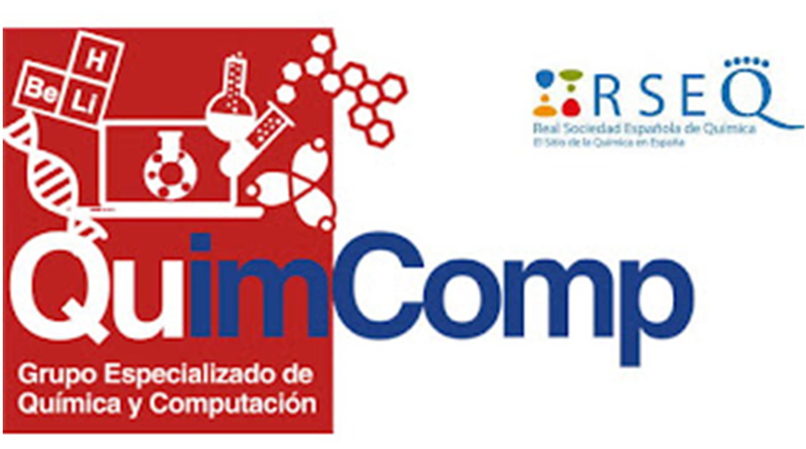
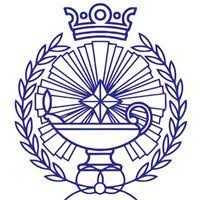

--- 
layout: page
title : Sponsors
feature-img: "assets/img/header/tab_back.png"
position: 7
---

### Funding agencies

Thanks to the <a href='https://geqc.rseq.org/'>Computers in Chemistry Group (GEQC) of the Spanish Royal Society of Chemistry (RSEQ)</a>, students are benefiting from very low registration fees that cover their stays at the <a href='https://resijaca.unizar.es/'>Residencia Universitaria de Jaca</a> and their meals. Additionally, GEQC members receive a 30 EUR discount on their fees.

Thanks to the <a href='https://colegioquimicos.com/'>Colegio de Químicos de la Comunidad Valenciana</a>, two students will be awarded travel grants of 80 EUR each.

Thanks to the <a href='https://www.csic.es/en'>Consejo Superior de Investigaciones Científicas (CSIC)</a>, the <a href='https://www.ciencia.gob.es/en/'>Ministry of Science, Innovation and Universities of Spain (MCIN)</a>, and <a href='https://next-generation-eu.europa.eu/index_en'>NextGenerationEU</a>, the CAMLC24 has achieved the category of micro-credential. Additionally, these organizations provide funds to cover trips and maintenance for the organizing committee.

<!-- <html>
<head>

</head>
<body>

<table id="customers">
  <tr>
    <td>&nbsp;&nbsp;&nbsp;&nbsp;&nbsp;&nbsp;&nbsp;&nbsp;&nbsp;&nbsp;&nbsp;&nbsp;&nbsp;&nbsp;&nbsp;&nbsp;&nbsp;&nbsp;&nbsp;&nbsp;&nbsp;&nbsp;&nbsp;&nbsp;&nbsp;&nbsp;&nbsp;&nbsp;&nbsp;&nbsp;&nbsp;&nbsp;&nbsp;&nbsp;</td>
    <td>
      
    </td>
    <td>
      
    </td>
  </tr>
</table>

</body>
</html> -->

